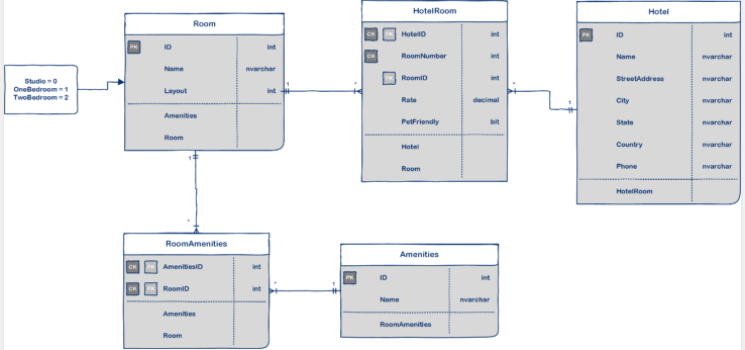

# Async Inn 

## Description
This is a RESTful API server built using ASP.NET Core to allow Async Hotel management to better manage the assets in their hotels. This application can modify and manage rooms, amenities, and new hotel locations. The data entered by the user will persist across a relational database and maintain its integrity as changes are made to the system.

## **Async Inn ERD:**


* Hotel table has one to many relationship with HotelRoom table
* Room table has one to many relationship with HotelRoom table
* Amenities table has one to many relationship with RoomAmenities table
* Room table  has one to many relationship with RoomAmenities table
* RoomAmenities and HotelRoom tables are a Composite tables


## Endpoints

### Hotels

| Method | EndPoint | 
|:-|:-|
| GET | ```/api/Hotels``` | 
| POST | ```/api/Hotels``` |
| GET | ```/api/Hotels/{id}``` |
| PUT | ```/api/Hotels/{id}``` |
| DELETE | ```/api/Hotels/{id}``` |


### Rooms

| Method | EndPoint | 
|:-|:-|
| GET | ```/api/Rooms/``` | |
| POST | ```/api/Rooms/``` | |
| GET | ```/api/Rooms/{id}``` | |
| PUT | ```/api/Rooms/{id}``` | |
| DELETE | ```/api/Rooms/{id}``` | |


### Amenities

| Method | EndPoint | 
|:-|:-|
| GET | ```/api/Amenities``` | |
| POST | ```/api/Amenities``` | |
| GET | ```/api/Amenities/{id}``` | |
| PUT | ```/api/Amenities/{id}``` | |
| DELETE | ```/api/Amenities/{id}``` | |

### HotelRooms

| Method | EndPoint | 
|:-|:-| 
| GET | ```/api/Hotels/{hotelId}/Rooms``` | |
| POST | ```/api/Hotels/{hotelId}/Rooms``` | |
| GET | ```/api/Hotels/{hotelId}/Rooms/{roomNumber}``` | |
| PUT | ```/api/Hotels/{hotelId}/Rooms/{roomNumber}``` | |
| DELETE | ```/api/Hotels/{hotelId}/Rooms/{roomNumber}``` | |
